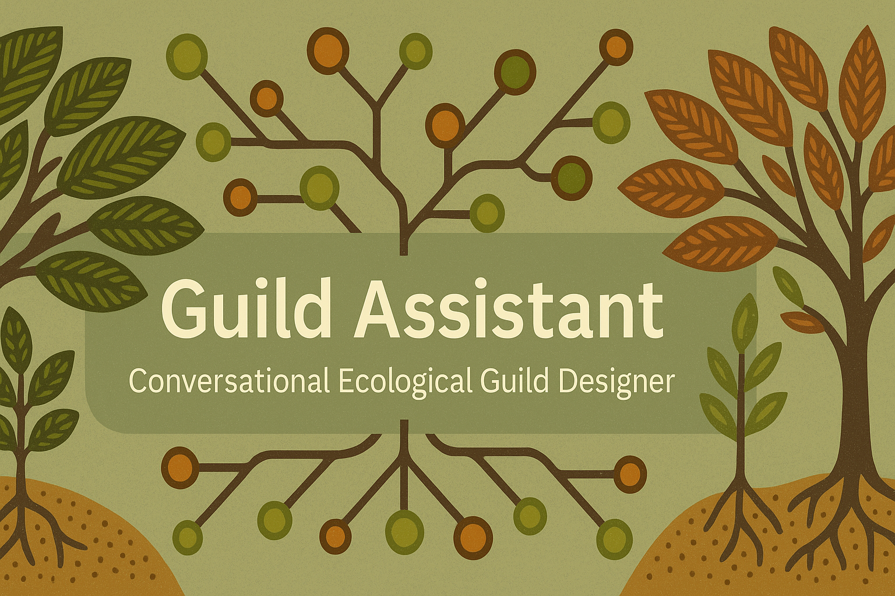

# Guild Assistant

<p align="center">
  
</p>

**Guild Assistant** is a Conversational AI tool that helps design ecologically sound and site-specific life guilds.

---

## Project Description

A tool that helps design native plant guilds for ecological restoration, agroforestry, and permaculture. It combines **LLMs**, **RAG (Retrieval-Augmented Generation)**, **Semantic Web Knowledge Graphs**, and **ML-based recommendations** — built with modern AI engineering patterns to reason about combinations of flora and fauna for specific ecoregions, climates, and goals.

## Motivation

**Ecological guilds** — combinations of flora and fauna that support each other — are core to agro-ecosystems of many tribal peoples and indigenous communities all over the world, and more recently to permaculture design, agro-ecology and ecological conservation. With over **382,000 species of plants** and **867 terrestrial ecoregions worldwide**, selecting species that work well together, *adapted to specific climates, soils, and human needs* requires integrating vast and diverse knowledge. An assistive tool to help the process is very beneficial. 

## Project Goals

Guild Assistant aims to be a **conversational design companion** that helps permaculture designers and conservationists:
- Explore species options for their location
- Understand ecological interactions
- Generate guilds adapted to local context and human needs
- Learn as they interact with the system

## Learning and Capstone Goals

This is also a **Capstone project** with these goals:
- Build a *working MVP* that shows value to users
- Learn and apply **LLM orchestration patterns** (LangChain, LangGraph, CrewAI)
- Combine **RAG** with **structured Semantic Web knowledge** (RDF/SPARQL)
- Implement **ML-based recommendation** from ecological data
- Demonstrate **explainable AI** — traceable suggestions grounded in data
- Contribute a novel and useful tool to the **AI for Ecology / Permaculture** community

---

## Stack and Tools

- **LLM Orchestration:** LangChain, LangGraph or CrewAI
- **Conversational UI:** Gradio
- **Vector Search / RAG:** ChromaDB, Weaviate
- **Semantic Web:** RDFLib, SPARQL, OWL ontologies
- **ML:** Scikit-learn (baseline), PyKEEN (graph embeddings), LightGBM / XGBoost (optional)
- **Data:** GBIF, World Flora Online, WWF Ecoregions, scientific papers
- **Development:** Python 3.11, Micromamba, Docker / Dev Container, VS Code

---

## ⚙️ Dev Prerequisites

Before you begin, ensure you have the following installed on your system:

| Tool          | Purpose                               | Install Link / Command                          |
|---------------|----------------------------------------|--------------------------------------------------|
| [Docker](https://www.docker.com/) | Containerization engine              | [Install Docker](https://docs.docker.com/get-docker/) |
| [Just](https://github.com/casey/just) | Task runner for common dev tasks    | `brew install just` (macOS) or follow [install guide](https://github.com/casey/just#installation) |
| (Optional) [VS Code](https://code.visualstudio.com/) | IDE with DevContainer integration  | [Install VS Code](https://code.visualstudio.com/) |
| (Optional) Dev Containers Extension | Enables DevContainer support in VS Code | [Install Extension](https://marketplace.visualstudio.com/items?itemName=ms-vscode-remote.remote-containers) |

---

## 🚀 Development Environment Setup

This project uses Docker + Dev Containers for a consistent, reproducible setup.

### ✅ Option 1: VS Code (Recommended)

1. Install the [Dev Containers extension](https://marketplace.visualstudio.com/items?itemName=ms-vscode-remote.remote-containers).
2. Open this project folder in VS Code.
3. Run `Dev Containers: Reopen in Container`.

VS Code will automatically:
- Pull and use the `ai-thin-crust` image (prebuilt dev base)
- Mount your project code at `/workspace`
- Use a persistent Docker volume for installed Python packages
- Run `pip install --upgrade -r requirements.txt` to install project-specific dependencies

You can also use `just` commands inside VS Code’s terminal, such as:

```bash
just install
just shell
just jupyter
```

---

### 💻 Option 2: Any Terminal / Other IDEs (e.g., Zed, JetBrains)

1. Ensure Docker and Just are installed.
2. Launch the container manually:

```bash
just up
```

3. Access the container shell:

```bash
just shell
```

4. Install Python dependencies:

```bash
just install
```

## 📦 Managing Python Dependencies

This project uses a two-file system to manage Python dependencies:

- `requirements.in`: Human-editable list of desired packages
- `requirements.txt`: Fully resolved and pinned versions (auto-generated)

### 🔄 To update dependencies:

1. Modify `requirements.in` as needed
2. Run:

```bash
just freeze
```

This will regenerate `requirements.txt` using `pip-compile` (inside the container).

⚠️ **Do not edit `requirements.txt` manually.**

## Environment variables

This project uses a .env file to configure environment-specific values for Docker Compose, just automatically loads the variables set in .env file. As a developer you can have your own .env file in the base folder of the project.

### 🔹 Step 1: Create your .env

Copy the provided .env.example file to .env if it doesn't already exist:
```bash
just init-env
```
Edit .env as needed:
```bash
DOCKER_TAG=2025-06a
CONTAINER_NAME=guild-assistant-dev
```
.env is auto-loaded by both Docker Compose and VS Code DevContainers when you launch the environment.

### 🔒 Note:

- .env should not be committed to version control.
-	Add it to your .gitignore if it’s not already listed: ```.env```

## 📚 Topics

`permaculture` `llm` `rag` `semantic-web` `knowledge-graph` `machine-learning` `guild-design` `gradio` `ecology` `capstone-project` `ml4ecology`

---

## 📄 License

This project is licensed under the **Apache License 2.0**.  
See the [LICENSE](LICENSE) file for details.
